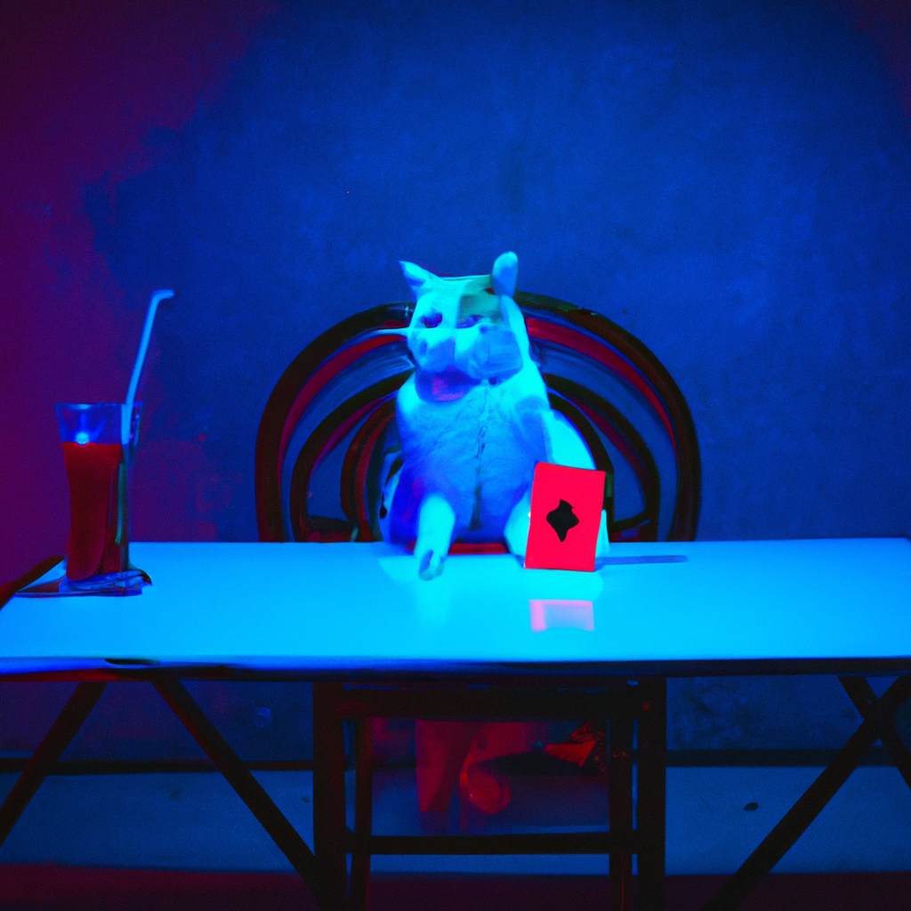

# Simple Ai Video Generator

^^ The amazing Dalle-2 API /s

## Output Example:
A demo output video generated by this project can be found here:
- On Vimeo: https://vimeo.com/855961539
- In this repository: `demo_output/video.mp4`

## How to run:
- Set OpenAI API Key: `export OPENAI_API_KEY=<KEY>`
- Set Elevenlabs API Key: `export ELEVEN_API_KEY=<KEY>`
- In `./src/main.py` (bottom): set the channel name, the desired topic, voice name, and the destination dir.
- Run `./src/main.py`

## PoC development:
- [x] GPT-turbo to generate video script and captions
- [x] Generate images with Dalle2 (or something much better if possible)
- [x] Elevenlabs api to generate narration
- [x] Get length of mp3 speech
- [x] Calculate time of each slide (equal times for now)
- [x] Generate output mp4 video
- [ ] Background music
    - TBD

## Known issues:
- QuickTime Player on MacOS plays the audio incorrectly after a few seconds of playback. There is no problem with the video and it's audio, it's an issue with this specific player. The video can be uploaded without issues to YouTube and played with other players.

## Contribution:
Feel free to fork, suggest ideas, report issues, and give general constructive feedback.

`^(;,;)^`